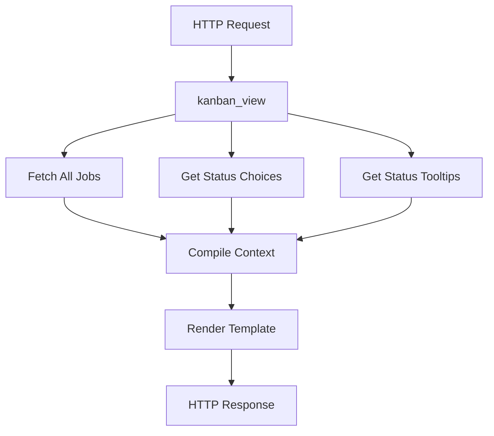
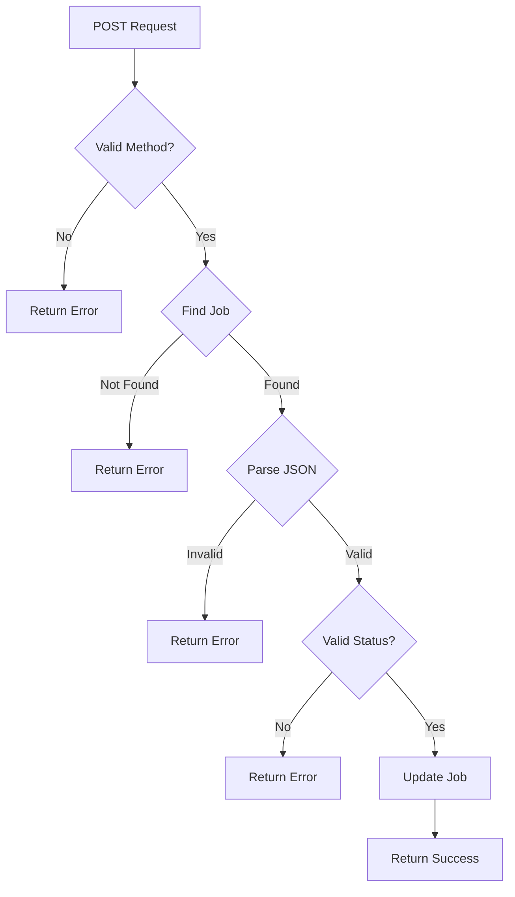
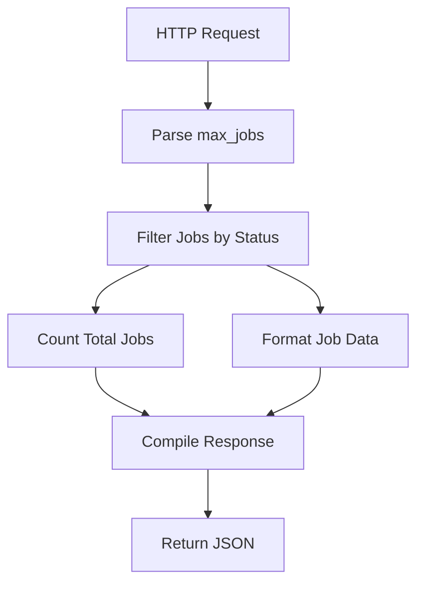

# Kanban Views Documentation

## Overview

This module provides views for managing a Kanban board interface for jobs, including functionality for viewing, updating status, and fetching jobs by status.

## Views

### kanban_view

**Type**: Function-based View

**Purpose**: Renders the main Kanban board interface

**Returns**: HttpResponse

### Function Signature

```python
def kanban_view(request: HttpRequest) -> HttpResponse
```

### **Context Data**

- : QuerySet of all Job objects

    `jobs`

- : Available job status choices from Job model

    `status_choices`

- : Tooltips for each status

    `status_tooltips`


### **Data Flow**



### **update_job_status**

**Type** : Function-based View

**Purpose** : Updates job status via AJAX

**Decorator** :

`@csrf_exempt`

**Returns**: JsonResponse

### **Function Signature**

```python
def update_job_status(request: HttpRequest, job_id: UUID) -> HttpResponse
```

### **Parameters**

- : HTTP request object

    `request`

- : UUID of the job to update

    `job_id`


### **Request Format**

```json
{
	"status": "new_status_value"
}
```

**Response Formats**

**Success Response**:

```json
{
    "success": true
}

```

**Error Responses**:

```json
{
    "success": false,
    "error": "Error message"
}

```


### **Error Cases**

1. Invalid JSON payload
2. Missing/invalid status
3. Job not found
4. Invalid request method

### **Data Flow**



### **fetch_jobs**

**Type** : Function-based View

**Purpose** : Fetches jobs for a specific status

**Returns** : JsonResponse

### **Function Signature**

```python
def fetch_jobs(request: HttpRequest, status: str) -> JsonResponse
```

### **Parameters**

- : HTTP request object

    `request`

- : Status value to filter jobs

    `status`

- Query Parameter:  (optional, default=10)

    `max_jobs`


### **Response Format**

```json
{
    "jobs": [
        {
            "id": "uuid",
            "name": "string",
            "description": "string",
            "job_number": "string",
            "client_name": "string",
            "contact_person": "string",
            "status": "string",
            "paid": boolean
        }
    ],
    "total": integer
}

```


### **Data Flow**



## **Security Considerations**

### **CSRF Protection**

- `update_job_status` is CSRF exempt
- Should implement alternative security measures
- Consider adding authentication checks

### **Input Validation**

- UUID validation for job_id
- Status value validation
- JSON payload validation

### **Query Optimization**

- Limited job fetching with max_jobs parameter
- Single query for total count
- Efficient attribute access

## **Error Handling**

### **JSON Processing**

- Handles JSON decode errors
- Provides clear error messages
- Maintains consistent response format

### **Database Operations**

- Handles Job.DoesNotExist exceptions
- Safe attribute access with getattr
- Proper type casting for parameters

## **Performance Considerations**

### **Query Optimization**

- Limited result set with slicing
- Separate count query for total
- Efficient status filtering

### **Response Format**

- Consistent JSON structure
- Minimal data transfer
- Human-readable status values
