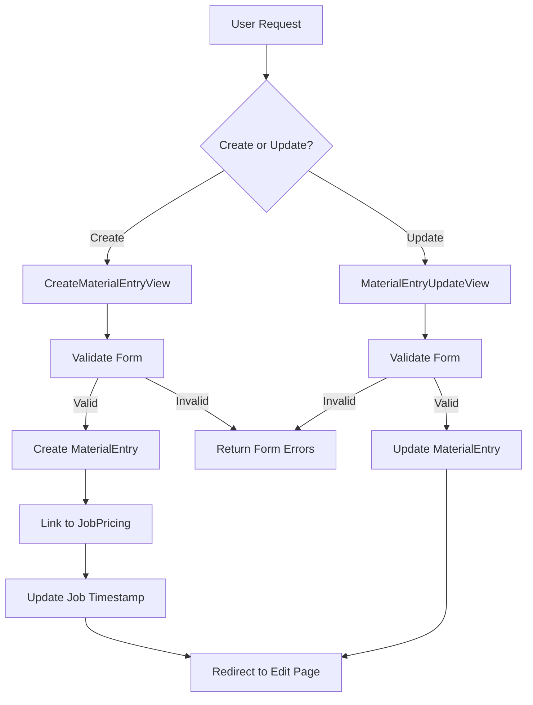

# **Material Entry Views Technical Documentation**

## **Models Used**

- **MaterialEntry** : The primary model representing material entries
- **JobPricing** : Related model that connects materials to specific jobs
- **Job** : Parent model of JobPricing that tracks last updates

## **CreateMaterialEntryView**

Extends Django's

`CreateView`

for creating new material entries.

### **Class Attributes**

- **model** :
    
    `MaterialEntry`
    
- **form_class** :
    
    `MaterialEntryForm`
    
- **template_name** :
    
    `"jobs/create_material_entry.html"`
    

### **Methods**

### **`form_valid(form: MaterialEntryForm) -> JsonResponse`**

- Handles valid form submission
- Creates new MaterialEntry instance without committing
- Associates entry with JobPricing using URL parameter
    
    `job_pricing_id`
    
- Updates job's  timestamp
    
    `last_updated`
    
- Returns JSON response via parent class implementation

### **`get_success_url() -> str`**

- Generates URL for redirect after successful creation
- Returns URL to edit job pricing page using
    
    `self.object.job_pricing.pk`
    

### **`form_invalid(form: MaterialEntryForm) -> JsonResponse`**

- Handles invalid form submission
- Logs form errors for debugging
- Returns error response via parent class implementation

### **Template Context**

Default CreateView context plus:

- **form** : Instance of MaterialEntryForm
- **object** : New MaterialEntry instance (if created)

## **MaterialEntryUpdateView**

Extends Django's

`UpdateView`

for editing existing material entries.

### **Class Attributes**

- **model** :
    
    `MaterialEntry`
    
- **form_class** :
    
    `MaterialEntryForm`
    
- **template_name** :
    
    `"jobs/edit_material_entry.html"`
    

### **Methods**

### **`form_valid(form: MaterialEntryForm) -> JsonResponse`**

- Handles valid form submission
- Updates existing MaterialEntry instance
- Returns JSON response via parent class implementation

### **`get_success_url() -> str`**

- Generates URL for redirect after successful update
- Returns URL to edit job pricing page using
    
    `self.object.job_pricing.pk`
    

### **Template Context**

Default UpdateView context plus:

- **form** : Instance of MaterialEntryForm with existing data
- **object** : Current MaterialEntry instance

## **Form Details (MaterialEntryForm)**

- Handles validation and cleaning of material entry data
- Likely includes fields for:
    - Material description
    - Quantity
    - Unit price
    - Additional notes/metadata

## **Template Requirements**

### **create_material_entry.html**

- Form for creating new material entries
- Should include:
    - CSRF token
    - Form fields
    - Submit button
    - Error display section

### **edit_material_entry.html**

- Form for editing existing material entries
- Should include:
    - CSRF token
    - Pre-populated form fields
    - Submit button
    - Error display section

## **Error Handling**

- Form validation errors are logged with debug level
- Invalid forms return to the same page with error messages
- Object not found errors (404) are handled by get_object_or_404

### **Data Flow**

1. Receives form data for an existing MaterialEntry
2. Validates the submitted form data
3. If valid:
    - Updates the MaterialEntry instance
    - Redirects to the job pricing edit page
4. If invalid:
    - Returns form with validation errors

## **Mermaid Diagram**

