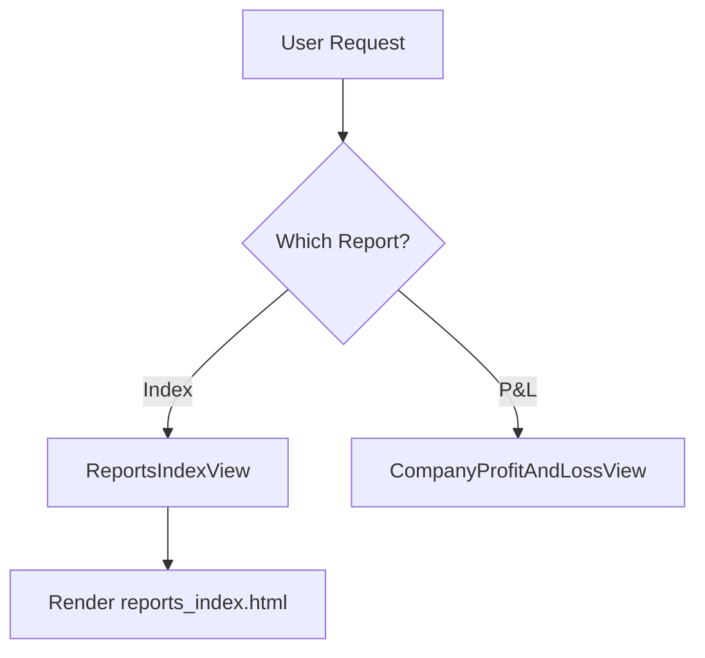

# **Reports Views Documentation**

## **Overview**

This module contains two template-based views for displaying reports:

`ReportsIndexView`and `CompanyProfitAndLossView`. 

Both views extend Django's `TemplateView`, providing simple template rendering functionality.

## **ReportsIndexView**

### **Purpose**

Serves as the main entry point for the reporting system, displaying a list or dashboard of available reports.

### **Technical Details**

- **View Type** : TemplateView
- **Template** :

    `reports/reports_index.html`

- **Context** : Default TemplateView context

## **CompanyProfitAndLossView**

### **Purpose**

Displays the profit and loss report for the company.

### **Technical Details**

- **View Type** : TemplateView
- **Template** :

    `reports/report_company_profit_and_loss.html`

- **Context** : Default TemplateView context

## **Data Flow Diagram**

