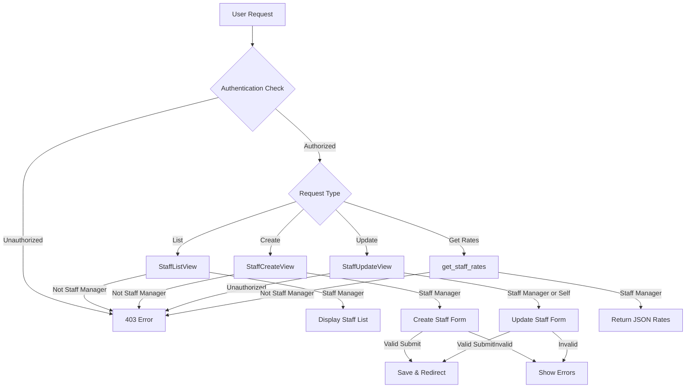

# **Staff Management Views Documentation**

## **Overview**

This module provides views for managing staff members, including listing, creating, updating, and retrieving staff rates. All views implement authentication and authorization checks.

## **Views**

### **`StaffListView`**

A protected view that displays all staff members.

### **Technical Details**

- **View Type**: `ListView`
- **Access** : Requires login and staff manager permissions
- **Model** : Staff (Custom User Model)
- **Template**: `list_staff.html`
- **Context**:
    - `staff_list`: QuerySet of all staff members

### **`StaffCreateView`**

Handles the creation of new staff members.

### **Technical Details**

- **View Type**: `CreateView`
- **Access**: Requires login and staff manager permissions
- **Model**: `Staff`
- **Form**: `StaffCreationForm`
- **Template**:
    
    `create_staff.html`
    
- **Success URL** : Redirects to staff list
- **Context**:
    - Default `CreateView` context
    - Form instance

### **`StaffUpdateView`**

Manages updates to existing staff members.

### **Technical Details**

- **View Type**: `UpdateView`
- **Access**: Requires login and either:
    - Staff manager permissions, or
    - Being the staff member being updated
- **Model:**  `Staff`
- **Form**: `StaffChangeForm`
- **Template**: `update_staff.html`
- **Success URL** : Redirects to staff list
- **Context**:
    - Default `UpdateView` context
    - Form instance

### **`get_staff_rates`**

Function-based view that returns staff rate information.

### **Technical Details**

- **View Type** : Function-based view
- **Access** : Requires login and staff manager permissions
- **Returns** : JSON response containing:
    - `wage_rate`: Staff member's wage rate
- **Error Handling** : Returns 403 for unauthorized access, 404 for non-existent staff

## **Authorization Rules**

- Most operations require staff manager status ( )
    
    `is_staff_manager()`
    
- Staff members can update their own records
- Unauthorized access returns appropriate error responses

## **Data Flow Diagram**

