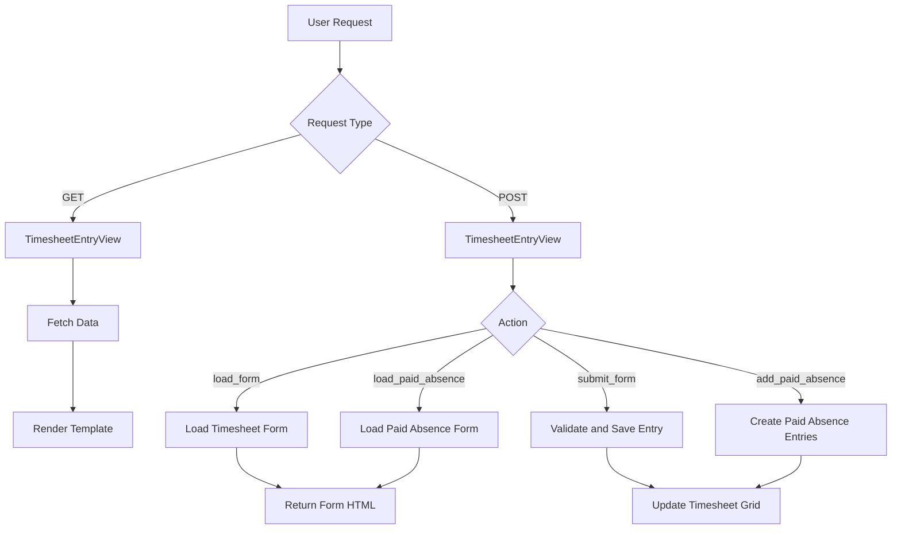

# **Timesheet Entry View Documentation**

## **Overview**

The `TimesheetEntryView` is a Django template-based view that manages the display and interaction with timesheet entries for specific staff members on specific dates. It enables users to view, edit, and navigate timesheet data efficiently.

## **Technical Details**

### **View Type**

- Extends Django's `TemplateView`
- Template: `time_entries/timesheet_entry.html`

---

## **GET Method**

### **Purpose**
Handles data retrieval and preparation for rendering the timesheet entry page, ensuring a user-friendly experience with dynamic navigation and data presentation.

### **Parameters**

- `date`: Target date in `YYYY-MM-DD` format.
- `staff_id`: ID of the staff member whose timesheet is being accessed.

---

### **Workflow**

1. **Date Validation**:
   - Parses the `date` parameter into a `datetime.date` object.
   - Validates the format to ensure compliance with `YYYY-MM-DD`.

2. **Staff Data Retrieval**:
   - Ensures the `staff_id` is not excluded based on `EXCLUDED_STAFF_IDS`.
   - Retrieves the staff member from the database, raising a 404 if not found.

3. **Timesheet Entries**:
   - Queries the database for timesheet entries matching the `date` and `staff_id`.
   - Includes related job and client information for richer context.

4. **Jobs Data**:
   - Fetches all open jobs (statuses: quoting, approved, in progress, special).
   - Provides job and client details for assignment options.

5. **Navigation Data**:
   - Determines the next and previous staff members for seamless navigation.
   - Implements wraparound logic for user convenience.

6. **Context Construction**:
   - Prepares all necessary data for rendering the timesheet page:
     - Staff member details.
     - Serialized timesheet and job data.
     - Navigation controls.

---

### **Context Data**

- `staff_member`: The staff instance being viewed.
- `staff_member_json`: Serialized details of the staff member.
- `timesheet_date`: The formatted date string.
- `scheduled_hours`: The staff member's scheduled hours for the date.
- `timesheet_entries_json`: Serialized timesheet entries for the date.
- `jobs_json`: Serialized list of open jobs.
- `next_staff`: The next staff member for navigation.
- `prev_staff`: The previous staff member for navigation.

---

### **Models Interaction**

- **Staff**: Fetches staff details, including wage rates and availability.
- **TimeEntry**: Handles querying timesheet entries for the specified staff and date.
- **Job**: Provides details of open jobs for assignment and reference.

---

## **POST Method**

### **Purpose**
Manages interactions related to timesheet entries and paid absences, including form loading, submission, and entry creation.

### **Actions Supported**

- `load_form`: Dynamically loads the timesheet entry form.
- `submit_form`: Validates and saves a new or updated timesheet entry.
- `load_paid_absence`: Loads the form for managing paid absences.
- `add_paid_absence`: Creates entries for paid absences, excluding weekends.

### **Error Handling**

- Validates input data for correct format and logical consistency.
- Ensures all database operations (retrieval, creation, updates) handle missing or invalid records gracefully.

---

## **Autosave Timesheet View**

### **Purpose**

A function-based view designed to handle automatic saving of timesheet entries through AJAX, ensuring real-time updates with minimal user intervention.

---

### **Technical Details**

- **View Type**: Function-based view.
- **HTTP Method**: POST.
- **Content Type**: JSON.

---

### **Request Data Structure**

```json
{
    "time_entries": [
        {
            "id": "optional-existing-entry-id",
            "hours": "decimal_value",
            "description": "string",
            "is_billable": boolean,
            "notes": "string",
            "rate_type": "enum_value",
            "job_data": {
                "id": "job_id",
                "charge_out_rate": "decimal_value"
            },
            "staff_id": "staff_id",
            "timesheet_date": "YYYY-MM-DD"
        }
    ],
    "deleted_entries": ["entry_id_1", "entry_id_2"]
}
```

### **Workflow**

1. **Request Validation**:
    - Ensures the JSON payload is properly formatted.
    - Validates required fields in `time_entries` and `deleted_entries`.
2. **Entry Processing**:
    - Updates existing entries or creates new ones, ensuring no duplicates.
    - Deletes entries marked for removal.
3. **Response**:
    - Returns success with updated entries or detailed errors for invalid data.

---

### **Response Format**

- **Success**:

    ```json
    {"success": true, "updated_entries": [1, 2, 3]}
    ```

- **Error**:

    ```json
    {"error": "Invalid JSON", "messages": ["Details of the error."]
    ```
---

## **Data Flow Diagram**



---

## **Error Handling**

- Handles JSON parsing errors.
- Validates logical and relational constraints (e.g., staff and job associations).
- Provides detailed feedback for errors during form submission or entry processing.
