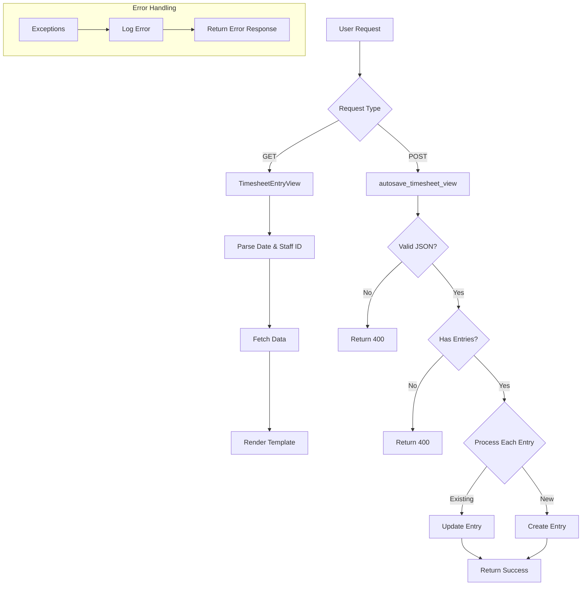

# **Timesheet Entry View Documentation**

## **Overview**

The `TimesheetEntryView` is a template based view that handles the display and management of timesheet entries for staff members. It provides functionality to view timesheet entries for a specific date and staff member, along with navigation between different staff members.

## **Technical Details**

### **View Type**

- Extends Django's `TemplateView`
- Template: `time_entries/timesheet_entry.html`

### **GET Method**

Handles retrieval and display of timesheet data.

### **Parameters**

- `date`: Date in YYYY-MM-DD format
- `staff_id`: ID of the staff member

### **Data Processing**

1. **Date Validation**
    - Converts string date to datetime object
    - Validates date format
2. **Staff Data**
    - Retrieves staff member information
    - Includes ID, name, and wage rate
3. **Time Entries**
    - Fetches existing entries for staff member on specified date
    - Includes related job and client information
4. **Jobs Data**
    - Retrieves open jobs (status: quoting, approved, in_progress, special)
    - Includes job details and client information
5. **Staff Navigation**
    - Determines next and previous staff members
    - Implements wraparound navigation

### **Context Data**

- `staff_member`: Staff instance
- `staff_member_json`: Serialized staff data
- `timesheet_date`: Formatted date string
- `scheduled_hours`: Staff's scheduled hours for the date
- `timesheet_entries_json`: Serialized timesheet entries
- `jobs_json`: Serialized jobs data
- `next_staff`: Next staff member for navigation
- `prev_staff`: Previous staff member for navigation

### **Models Used**

- `Staff`: User model for staff members
- `TimeEntry`: Time entry records
- `Job`: Job information

Note: The POST method is not yet implemented in the provided code but is intended for saving time entries

## **Autosave Timesheet View**

### **Purpose**

Function-based view that handles automatic saving of timesheet entries through AJAX requests.

### **Technical Details**

- **View Type** : Function-based view
- **HTTP Method** : POST only
- **Content Type** : JSON

### **Request Data Structure**

```json
{
    "time_entries": [
        {
            "id": "optional-existing-entry-id",
            "hours": "decimal_value",
            "description": "string",
            "is_billable": boolean,
            "notes": "string",
            "rate_type": "enum_value",
            "job_data": {
                "id": "job_id",
                "charge_out_rate": "decimal_value"
            },
            "staff_id": "staff_id",
            "timesheet_date": "YYYY-MM-DD"
        }
    ]
}

```

### **Processing Flow**

1. **Request Validation**
    - Validates JSON format
    - Checks for presence of time entries
2. **Entry Processing**
    - Handles both new and existing entries
    - For existing entries:
        - Updates description, hours, billable status, notes, and rate type
    - For new entries:
        - Creates complete TimeEntry record
        - Links to job pricing and staff
        - Sets wage and charge-out rates

### **Response Format**

- Success:
    
    `{"success": true}`
    
- Errors:
    - Invalid JSON:  (400)
        
        `{"error": "Invalid JSON"}`
        
    - No entries:  (400)
        
        `{"error": "No time entries provided"}`
        
    - Other errors:  (500)
        
        `{"error": "error_message"}`
        

## **Updated Data Flow Diagram**



### **Error Handling**

- JSON parsing errors
- Missing or invalid data validation
- Database operation errors
- Comprehensive error logging

### **Models Interaction**

- **TimeEntry** : Create and update operations
- **Job** : Reference for job pricing
- **Staff** : Reference for staff details and wage rates
- **RateType** : Enum for wage rate multipliers