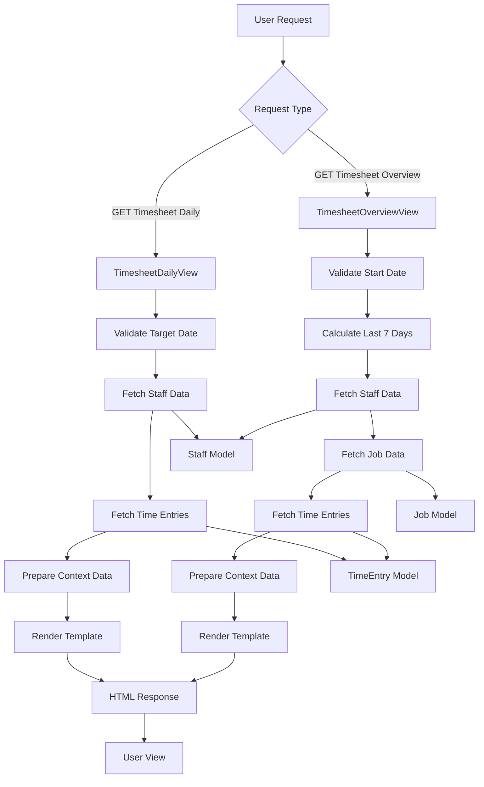

# **Timesheet Overview View Documentation**

## **Overview**

The `TimesheetOverviewView` is a template-based view that provides an overview of timesheet data for the past seven days. It aggregates information about staff schedules, job progress, and time entries to help monitor and analyze work distribution.

## **Technical Details**

### **View Type**

- Extends Django's `TemplateView`
- Template: `time_entries/timesheet_overview.html`

### **GET Method**

Handles retrieval and aggregation of timesheet data for a given date range.

### **Parameters**

- `start_date` (optional): Starting date in `YYYY-MM-DD` format. Defaults to seven days prior to the current date.

### **Data Processing**

1. **Start Date Handling**
    - Parses the `start_date` parameter.
    - Defaults to the last seven days ending yesterday if `start_date` is invalid or not provided.
2. **Staff Data**
    - Retrieves all staff members and their scheduled hours for each of the last seven days.
    - Includes each staff member's ID, name, and daily scheduled hours.
3. **Job Data**
    - Fetches open jobs with statuses: quoting, approved, in_progress, or special.
    - Includes job details like estimated hours, quoted hours, actual hours, billable hours, and revenue/cost metrics.
4. **Timesheet Entries**
    - Gathers all time entries for the last seven days.
    - Includes details like date, staff member, job, hours worked, billable status, wage rate, and charge-out rate.

### **Context Data**

- `start_date`: The starting date for the overview.
- `staff_data`: Aggregated data for all staff members, including their daily scheduled hours.
- `job_data`: Aggregated data for open jobs, including time and financial metrics.
- `timesheet_entries`: Detailed time entry records for the selected period.
- `last_seven_days`: List of the last seven dates.
- `context_json`: Serialized JSON representation of all context data.

### **Models Used**

- `Staff`: Staff member details, including schedules and hours.
- `Job`: Job information, including estimated, quoted, and actual hours.
- `TimeEntry`: Detailed records of time entries, including job and staff associations.

### **Error Handling**

- Defaults to a safe date range if `start_date` is invalid.
- Handles empty datasets gracefully, ensuring the view renders even if no data is available.

---

# **Timesheet Daily View Documentation**

## **Overview**

The `TimesheetDailyView` is a template-based view that displays detailed timesheet data for a specific day. It shows scheduled and actual hours for all staff members, along with detailed job entries.

## **Technical Details**

### **View Type**

- Extends Django's `TemplateView`
- Template: `time_entries/timesheet_daily_view.html`

### **GET Method**

Retrieves and processes daily timesheet data for the given date.

### **Parameters**

- `date` (optional): Target date in `YYYY-MM-DD` format. Defaults to the current date if not provided.

### **Data Processing**

1. **Date Parsing**
    - Parses the `date` parameter.
    - Defaults to the current date if the parameter is invalid or not provided.
2. **Staff Data**
    - Retrieves all staff members and their scheduled hours for the target date.
    - Includes actual hours worked and job details for each staff member.
3. **Time Entries**
    - Fetches all time entries for the target date.
    - Includes details like job name, hours, and billable status for each entry.

### **Context Data**

- `date`: The target date for the daily view.
- `staff_data`: Aggregated data for all staff members, including schedules, actual hours, and job entries.
- `context_json`: Serialized JSON representation of the staff data.

### **Models Used**

- `Staff`: Staff member details, including schedules.
- `TimeEntry`: Records of time entries for the target date.
- `Job`: Job information associated with time entries.

### **Error Handling**

- Defaults to the current date if `date` is invalid.
- Handles empty datasets gracefully, ensuring the view renders even if no data is available.

## **Data Flow**

