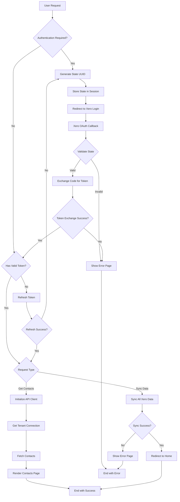

# **Xero Integration Views Documentation**

## **Overview**

This view handles the OAuth2 authentication flow and data synchronization with Xero's API. It provides endpoints for authenticating users managing OAuth tokens, and retrieving/syncing Xero data.

## **Components**

### **1. xero_authenticate(request)**

- **Purpose** : Initiates the OAuth2 authentication flow with Xero
- **Process** :
    - Generates a unique UUID for state verification
    - Stores the state in the session
    - Redirects user to Xero's authentication URL
- **Returns** : Redirect to Xero's OAuth login page

### **2. xero_oauth_callback(request)**

- **Purpose** : Handles the OAuth2 callback from Xero
- **Process** :
    - Retrieves authorization code and state from callback
    - Validates state against session state
    - Exchanges authorization code for access token
    - Handles potential authentication errors
- **Returns** : Redirects to data refresh or displays error page

### **3. refresh_xero_token(request)**

- **Purpose** : Refreshes the OAuth2 token when expired
- **Process** :
    - Attempts to refresh the existing token
    - Redirects to authentication if refresh fails
- **Returns** : Redirects to contacts page or authentication

### **4. get_xero_contacts(request)**

- **Purpose** : Retrieves contacts from Xero API
- **Process** :
    - Initializes Xero API clients
    - Gets tenant connections
    - Retrieves contacts for the first tenant
- **Returns** : Renders contacts template with retrieved data

### **5. refresh_xero_data(request)**

- **Purpose** : Synchronizes all Xero data
- **Process** :
    - Verifies authentication token
    - Triggers full data sync
    - Handles various error scenarios
- **Returns** : Redirects to home page or error page

## **Error Handling**

- OAuth authentication errors
- Token refresh failures
- API connection issues
- Missing tenant errors
- Generic exceptions with logging

## **Data Flow Diagram**

