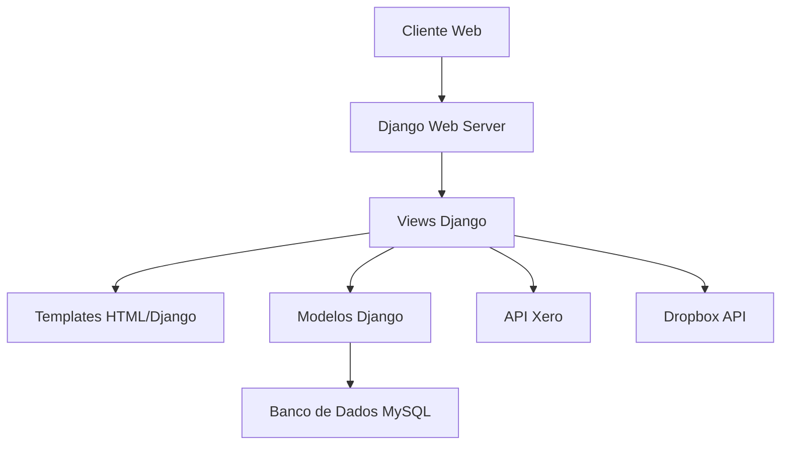
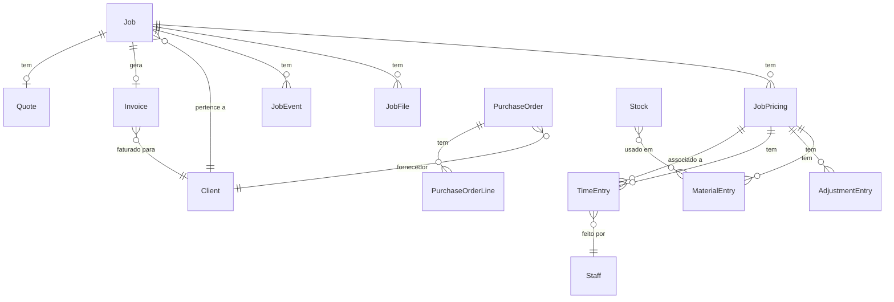
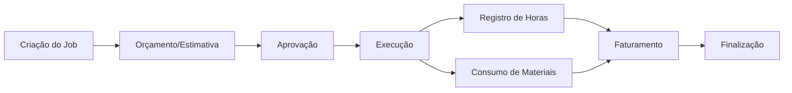
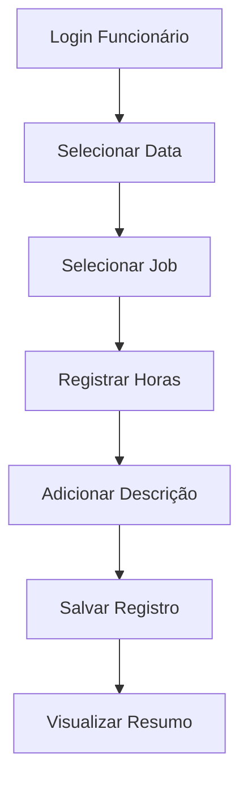
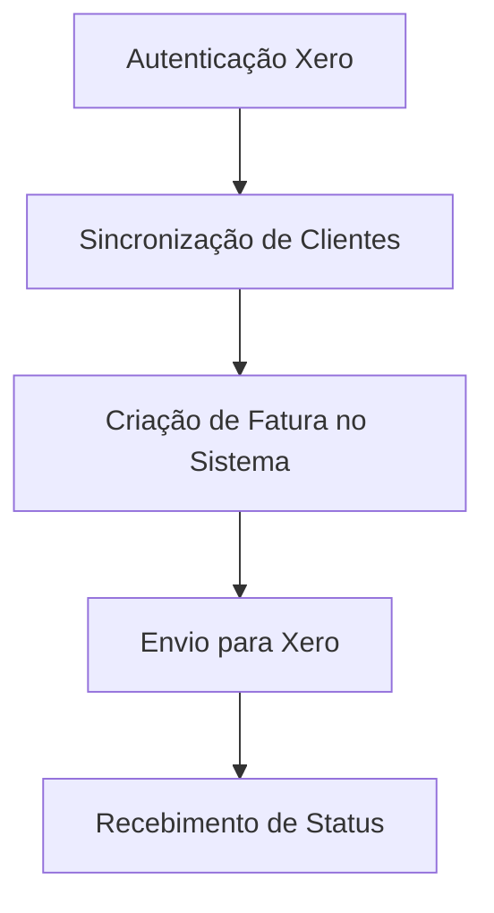
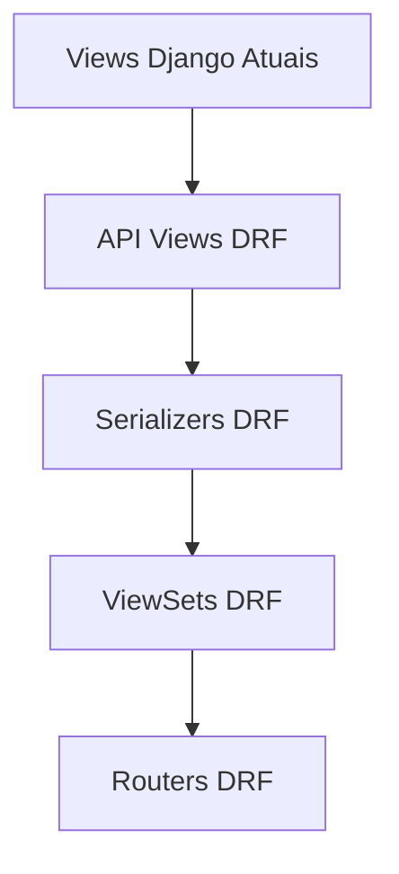
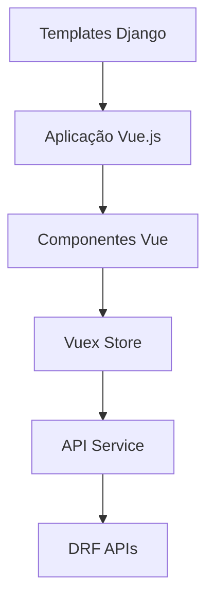

# Sistema de Gerenciamento de Trabalhos - Guia para Novos Colaboradores

## Índice

1. [Visão Geral do Sistema](#visão-geral-do-sistema)
2. [Arquitetura Atual](#arquitetura-atual)
3. [Stack Tecnológica](#stack-tecnológica)
4. [Modelo de Dados](#modelo-de-dados)
5. [Principais Fluxos de Trabalho](#principais-fluxos-de-trabalho)
6. [Plano de Migração](#plano-de-migração)
   - [Dividir o App Workflow](#dividir-o-app-workflow)
   - [Refatorar para Django REST Framework](#refatorar-para-django-rest-framework)
   - [Migrar Frontend para Vue.js](#migrar-frontend-para-vuejs)
7. [Guia para Resolução de Bugs](#guia-para-resolução-de-bugs)
8. [Recursos de Aprendizado](#recursos-de-aprendizado)

---

## Visão Geral do Sistema

O **Sistema de Gerenciamento de Trabalhos** é uma aplicação web desenvolvida para gerenciar o fluxo de trabalho de uma empresa de metalurgia, permitindo controle de projetos, orçamentos, registro de horas, faturamento e integração contábil.

### Principais Funcionalidades

- Gerenciamento de clientes e projetos (jobs)
- Sistema de Kanban para acompanhamento de status dos trabalhos
- Registro de horas trabalhadas (timesheet)
- Orçamentos e faturamento
- Integração com Xero (sistema contábil)
- Gestão de ordens de compra e estoque
- Geração de relatórios (PDFs, dados financeiros)

## Arquitetura Atual

A aplicação segue uma arquitetura monolítica tradicional do Django, com um único app principal (`workflow`) que contém todos os modelos, views e templates.



### Estrutura de Diretórios Simplificada

```
jobs_manager/
├── jobs_manager/        # Configurações do projeto Django
│   ├── settings/        # Múltiplas configurações (base, local, produção)
│   ├── urls.py          # URLs do projeto
│   └── wsgi.py          # Configuração WSGI
├── workflow/            # App principal (a ser dividido)
│   ├── api/             # Integrações com APIs externas
│   ├── enums/           # Enumerações e constantes
│   ├── forms/           # Formulários Django
│   ├── management/      # Comandos personalizados
│   ├── migrations/      # Migrações do banco de dados
│   ├── models/          # Modelos de dados
│   ├── services/        # Serviços de negócios
│   ├── templates/       # Templates HTML/Django
│   ├── templatetags/    # Tags e filtros personalizados
│   ├── tests/           # Testes automatizados
│   ├── utils/           # Utilitários e helpers
│   └── views/           # Views Django (organizadas por funcionalidade)
```

## Stack Tecnológica

### Backend
- **Python 3.x**: Linguagem de programação principal
- **Django 5.x**: Framework web
- **Django REST Framework**: Para APIs (uso limitado no estado atual)
- **MySQL**: Banco de dados relacional

### Frontend
- **Django Templates**: Sistema de templates do Django
- **Bootstrap 5**: Framework CSS
- **jQuery**: Biblioteca JavaScript
- **AG Grid**: Para tabelas interativas
- **Highcharts**: Para visualização de dados/gráficos
- **Quill**: Editor de texto rico
- **FullCalendar**: Para calendários e agendamentos
- **jsPDF/PDFMake**: Geração de documentos PDF no cliente

### Integrações
- **Xero API**: Integração contábil (faturamento, clientes, contas)
- **Dropbox**: Armazenamento de arquivos de projetos
- **NGINX**: Servidor web (em produção)

### DevOps
- **MySQL**: Banco de dados de produção
- **Servidor Linux**: Ambiente de produção
- **Systemd**: Gerenciamento de serviços
- **ngrok**: Utilizado para desenvolvimento/testes

## Modelo de Dados

Principais modelos e seus relacionamentos:



### Modelos-Chave

1. **Staff**: Modelo de usuário customizado (estende AbstractBaseUser)
2. **Client**: Armazena informações de clientes e fornecedores
3. **Job**: Representa um trabalho/projeto
4. **JobPricing**: Preços/orçamentos para um job (estimativa, cotação, realidade)
5. **TimeEntry**: Registro de horas trabalhadas
6. **MaterialEntry**: Materiais utilizados em um job
7. **Invoice/Bill**: Faturas e contas
8. **PurchaseOrder**: Ordens de compra
9. **Stock**: Controle de estoque de materiais

## Principais Fluxos de Trabalho

### Fluxo de Gestão de Jobs



### Fluxo de Registro de Horas



### Fluxo de Integração com Xero



## Plano de Migração

### Dividir o App Workflow

Recomendamos dividir o app `workflow` em múltiplos apps menores, cada um com responsabilidade única:

#### Proposta de Divisão

1. **accounts**: Autenticação e gerenciamento de usuários (Staff)
   - models: Staff, permissões relacionadas
   - views: login, logout, redefinição de senha

2. **clients**: Gerenciamento de clientes
   - models: Client
   - views: CRUD de clientes, integração com Xero

3. **jobs**: Gerenciamento de trabalhos/projetos
   - models: Job, JobEvent, JobFile
   - views: CRUD de jobs, fluxo de trabalho, Kanban

4. **timesheet**: Registro e gerenciamento de horas
   - models: TimeEntry
   - views: registro de horas, relatórios de horas

5. **pricing**: Preços, orçamentos e faturamento
   - models: JobPricing, MaterialEntry, AdjustmentEntry
   - views: gerenciamento de preços e orçamentos

6. **invoicing**: Faturamento e integração financeira
   - models: Invoice, Bill, Quote
   - views: criação de faturas, integração com Xero

7. **purchasing**: Compras e gestão de estoque
   - models: PurchaseOrder, PurchaseOrderLine, Stock
   - views: gerenciamento de compras, recebimento de materiais

8. **reports**: Relatórios e analytics
   - views: relatórios financeiros, KPIs, exportações

9. **integrations**: Integrações externas
   - Xero, Dropbox, outros sistemas

#### Passos para Implementação

1. Criar novos apps Django para cada domínio
2. Mover modelos relevantes para cada app
3. Atualizar imports e referências em todo o código
4. Ajustar migrações para refletir a nova estrutura
5. Testar exaustivamente cada app após a migração

### Refatorar para Django REST Framework

A migração para DRF envolve transformar as views atuais em APIs REST:



#### Estratégia de Implementação

1. **Fase 1**: Criação de serializers para todos os modelos
   - Definir serializers com validação e relações apropriadas
   - Implementar testes para garantir serialização correta

2. **Fase 2**: Desenvolver ViewSets e APIs para funcionalidades existentes
   - Começar com APIs de leitura (GET) em paralelo à interface existente
   - Adicionar gradualmente métodos POST, PUT, PATCH, DELETE
   - Implementar autenticação e permissões

3. **Fase 3**: Documentação e testes
   - Documentar APIs com drf-yasg ou drf-spectacular
   - Desenvolver testes de integração abrangentes

#### Exemplo de Transformação

**View Django Atual**:
```python
def kanban_view(request: HttpRequest) -> HttpResponse:
    active_jobs = Job.objects.filter(~Q(status="archived"))
    archived_jobs = Job.objects.filter(status="archived").order_by("-created_at")[:50]
    active_status_choices = [(key, label) for key, label in Job.JOB_STATUS_CHOICES if key != "archived"]
    active_status_tooltips = {key: Job.STATUS_TOOLTIPS[key] for key in Job.STATUS_TOOLTIPS if key != "archived"}
    context = {
        "jobs": active_jobs,
        "latest_archived_jobs": archived_jobs,
        "status_choices": active_status_choices,
        "status_tooltips": active_status_tooltips,
    }
    return render(request, "jobs/kanban_board.html", context)
```

**Equivalente em DRF**:
```python
class JobSerializer(serializers.ModelSerializer):
    client_name = serializers.CharField(source='client.name', read_only=True)
    
    class Meta:
        model = Job
        fields = ['id', 'name', 'job_number', 'status', 'client_name', 'description', 'created_at']

class JobListView(generics.ListAPIView):
    serializer_class = JobSerializer
    
    def get_queryset(self):
        status = self.request.query_params.get('status')
        if status == 'archived':
            return Job.objects.filter(status="archived").order_by("-created_at")[:50]
        return Job.objects.filter(~Q(status="archived"))
    
    def list(self, request, *args, **kwargs):
        queryset = self.filter_queryset(self.get_queryset())
        serializer = self.get_serializer(queryset, many=True)
        
        status_choices = [(key, label) for key, label in Job.JOB_STATUS_CHOICES if key != "archived"]
        status_tooltips = {key: Job.STATUS_TOOLTIPS[key] for key in Job.STATUS_TOOLTIPS if key != "archived"}
        
        return Response({
            'jobs': serializer.data,
            'status_choices': dict(status_choices),
            'status_tooltips': status_tooltips
        })
```

### Migrar Frontend para Vue.js

A migração do frontend envolve substituir os templates Django por componentes Vue.js que consomem as APIs:



#### Estratégia de Implementação

1. **Fase 1**: Configuração do ambiente Vue
   - Configurar projeto Vue.js com Vue CLI ou Vite
   - Definir estrutura de diretórios e padrões

2. **Fase 2**: Implementação incremental por funcionalidade
   - Priorizar páginas/recursos mais simples primeiro
   - Implementar componentes Vue equivalentes a cada template
   - Desenvolver serviços para comunicação com API

3. **Fase 3**: Migração de UI/UX
   - Manter inicialmente o layout Bootstrap para facilitar a transição
   - Reimplementar componentes de terceiros (AG Grid, Highcharts)
   - Adicionar melhorias de UX conforme possível

#### Exemplo de Transformação

**Template Django Atual**:
```html

<div class="card job-card" data-job-id="{{ job.id }}">
  <div class="card-header">{{ job.name }}</div>
  <div class="card-body">
    <p>Cliente: {{ job.client.name }}</p>
    <p>Número: {{ job.job_number }}</p>
    <p>Status: {{ job.get_status_display }}</p>
  </div>
</div>

```

**Equivalente em Vue.js**:
```vue
<template>
  <div>
    <div v-for="job in jobs" :key="job.id" class="card job-card">
      <div class="card-header">{{ job.name }}</div>
      <div class="card-body">
        <p>Cliente: {{ job.client_name }}</p>
        <p>Número: {{ job.job_number }}</p>
        <p>Status: {{ getStatusDisplay(job.status) }}</p>
      </div>
    </div>
  </div>
</template>

<script>
import { mapGetters } from 'vuex';

export default {
  computed: {
    ...mapGetters('jobs', ['jobs', 'statusChoices'])
  },
  methods: {
    getStatusDisplay(status) {
      return this.statusChoices[status] || status;
    }
  },
  created() {
    this.$store.dispatch('jobs/fetchJobs');
  }
}
</script>
```

## Guia para Resolução de Bugs

Para colaboradores que precisam resolver bugs na stack atual, são necessários conhecimentos em:

1. **Django**: Entender o ciclo de vida de requisições, views, models e templates
2. **ORM do Django**: Consultas ao banco de dados, relações entre modelos
3. **JavaScript/jQuery**: Para funcionalidades do lado do cliente
4. **Bootstrap 5**: Para componentes de UI

### Processo Recomendado para Correção de Bugs

1. **Identificação**: Use os logs para localizar a origem do problema
   - Logs principais: `logs/debug_sql.log`, `logs/xero_integration.log`
   - Verificar erros no console do navegador

2. **Reprodução**: Confirme se consegue reproduzir o bug em ambiente de desenvolvimento

3. **Testes**: Crie testes que demonstrem o bug antes de corrigi-lo

4. **Correção**: Implemente a solução seguindo os padrões do projeto

5. **Verificação**: Garanta que a correção não causou efeitos colaterais

### Padrões de Código

- **Python**: Seguir PEP 8, documentação com docstrings
- **Convenções de nomenclatura**: CamelCase para classes, snake_case para funções/variáveis
- **Logging**: Usar o logger apropriado para cada módulo
- **Tratamento de exceções**: Sempre capturar e registrar erros apropriadamente

## Recursos de Aprendizado

### Django e Python

- **[Documentação oficial do Django](https://docs.djangoproject.com/pt-br/)**
- **[Django para Iniciantes (William S. Vincent)](https://djangoforbeginners.com/)** - Livro
- **[Two Scoops of Django](https://www.feldroy.com/books/two-scoops-of-django-3-x)** - Livro sobre boas práticas
- **[Curso de Django na Alura](https://www.alura.com.br/formacao-django)** (em português)
- **[DjangoGirls Tutorial](https://tutorial.djangogirls.org/pt/)** (em português)

### Django REST Framework

- **[Documentação oficial do DRF](https://www.django-rest-framework.org/)**
- **[Construindo APIs com Django e DRF](https://buildapiswithdjango.com/)** - Livro
- **[Curso de REST APIs com Django na Udemy](https://www.udemy.com/course/django-python-advanced/)**
- **[Django REST Framework - Real Python](https://realpython.com/django-rest-framework-quick-start/)**

### Vue.js

- **[Documentação oficial do Vue.js](https://br.vuejs.org/index.html)** (em português)
- **[Vue Mastery](https://www.vuemastery.com/)** - Cursos e tutoriais
- **[Vue School](https://vueschool.io/)** - Cursos e tutoriais
- **[Curso de Vue.js na Alura](https://www.alura.com.br/formacao-vuejs)** (em português)
- **[Vue.js para Iniciantes - eBook](https://leanpub.com/vuejs-para-iniciantes)** (em português)

### Integração Django com Vue.js

- **[Full Stack Django & Vue](https://testdriven.io/courses/django-vue/)**
- **[Django + Vue Integration Tutorial](https://www.digitalocean.com/community/tutorials/how-to-set-up-a-client-server-architecture-with-django-and-vue-js)**
- **[Configurando Django + Vue (com Vite)](https://github.com/originjs/vite-plugin-federation/issues/44)**

### Ferramentas e Bibliotecas Específicas

- **[AG Grid](https://www.ag-grid.com/vue-data-grid/)** - Documentação para Vue.js
- **[Highcharts](https://www.highcharts.com/blog/tutorials/highcharts-vue-wrapper/)** - Wrapper para Vue.js
- **[Vue.js + Bootstrap 5](https://bootstrap-vue.org/)** - Componentes Bootstrap para Vue
- **[API do Xero](https://developer.xero.com/documentation/)** - Documentação oficial
- **[FullCalendar Vue Component](https://fullcalendar.io/docs/vue)** - Documentação para Vue.js

---

Este documento fornece uma visão geral do sistema atual e do plano de migração. À medida que o projeto evolui, recomendamos manter esta documentação atualizada para facilitar a integração de novos colaboradores.

Para qualquer dúvida específica ou esclarecimentos adicionais, entre em contato com a equipe de desenvolvimento.
```
